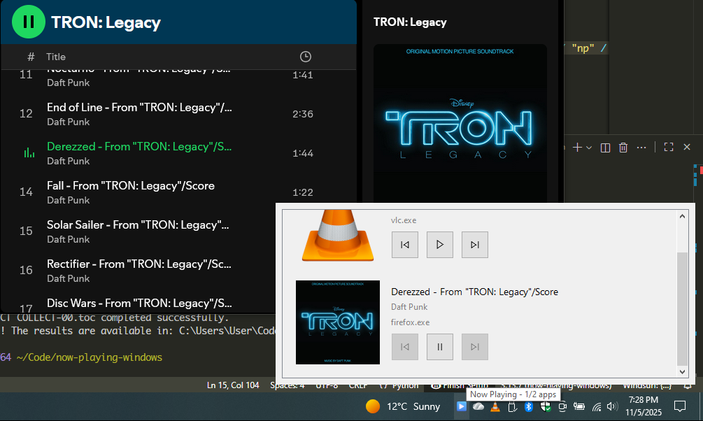

# 🎵 Now Playing

A lightweight tray application that displays media information from all applications broadcasting on **GlobalSystemMediaTransport**.  
It also provides **basic media controls** such as **Play, Pause, Next, and Previous**.

---

## ✨ Features

- 🎧 Displays real-time media info from apps broadcasting via GlobalSystemMediaTransport
- 🖼️ Shows thumbnail, title, and artist name
- ▶️ Basic playback controls:
  - Play / Pause  
  - Next track  
  - Previous track
- 🧭 Cross-app control support (where the media source allows it)

---
## 🎥 Screenshot(s)
> Screenshots may be outdated


---

## 📦 Installation

```bash
uv tool install git+https://github.com/raffleberry/now-playing
```
or 
Download it from [releases](https://github.com/raffleberry/now-playing/releases).
